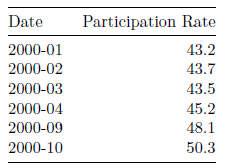
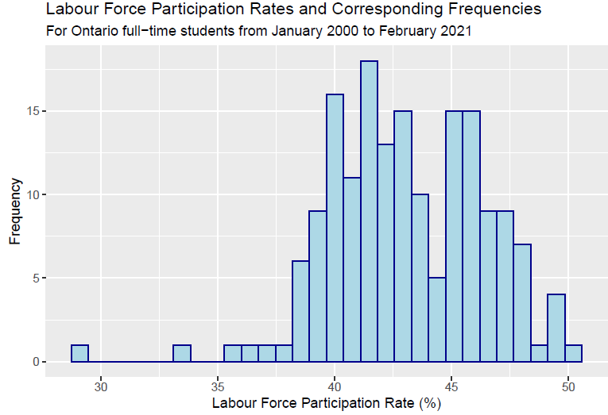
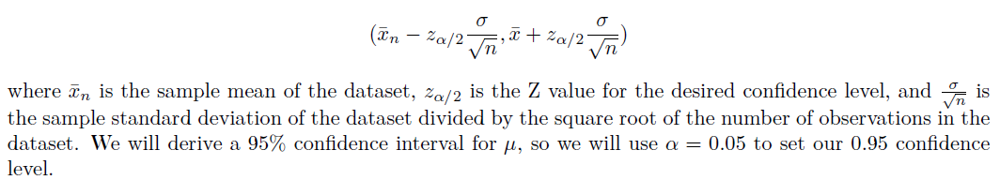
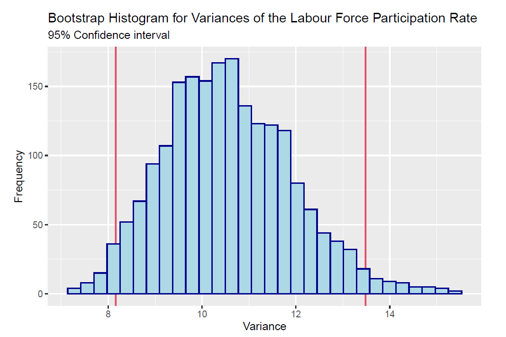
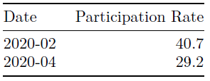

# Impact of the COVID-19 Pandemic on the Canadian Student Labor Force Participation Rate

# Introduction

When considering the economic implications of major recessions such as the 2008 global financial crisis
and the recent recession caused by the COVID-19 pandemic, the state of the labour force is among the
most important economic factors to understand. Typically the metric to reach for in these cases is the
unemployment rate, since it can be easily understood that a severe recession will cause unemployment rates
to rise. However, another statistic – the labour force participation rate – is also a very useful metric when
considering the health of the labour market.

Investopedia defines the labour force participation rate as “the percentage of all people of working age who
are employed or are actively seeking work.”1 It differs from the unemployment rate in that it includes
working-age individuals who may have been unemployed, but are willing and able to work. This means that
some people who are unemployed are still considered to be part of the labour force. Individuals who have
given up on their search for re-employment are referred to as “discouraged workers”2 and are excluded from
the labour force. Examining the labour force participation rate can therefore offer additional insight on the
state of workers themselves beyond whether or not they are currently working; an increase in the labour
force participation rate can be generally interpreted as an increase in the willingness to work of a group
of individuals, and a decrease indicates a general decrease in their willingness to work, and consequently, a
larger number of discouraged workers. We will conduct such an analysis in this report.

The objective of this analysis is to make use of confidence intervals to estimate the the range of values for
the population mean and variance of the labour force participation rate. The dataset that we will be using
in this analysis is the Unemployment rate, participation rate, and employment rate by type of student during
school months, monthly, unadjusted for seasonality3 dataset provided by Statistics Canada. This dataset
provides monthly percentages for the unemployment rate, participation rate, and employment rate of fulltime
students, part-time students, and non-students of both sexes from the ages of 15 to 24. In order to make
this analysis slightly more relevant to us as students, we will be analyzing the labour force participation rate
for Ontario-based full-time students only, from January 2000 to February 2021.

Our hypothesis is that confidence interval for the mean labour force participation rate should indicate that a
significant portion of students participate in the labour force, since many students often need to work to meet
their increased financial needs due to educational costs, or participate in training or internship programs.
Our prediction for the population variance of the labour force participation rate is that its confidence interval
should be relatively wide, since the time period from 2000-2021 includes two major recessions along with
other periods of economic upturn, which should have caused significant fluctuations in the state of the labour
force.

# Data

## Gathering and Cleaning Data

For this analysis, we are primarily interested in the percentage values for the labour force participation rate
amongst full-time students from January 2000 to February 2021. This data was obtained solely through the
[statCanR](https://cran.r-project.org/web/packages/statcanR/vignettes/statCanR.html) package and was imported into R in its entirety. The dataset in its initial state consisted of 4
471 500 observations of 19 variables, so some cleaning and organization was necessary. First, we grouped the
“Sex” category together so that we could work with observations for both males and females, and subsetted
this dataframe again to consider observations for all individuals between 15 to 24 years of age. Afterwards, we
subsetted the dataframe further to narrow the data down to observations for Ontario and full-time students.

Next, we removed all NA values for the labour force participation rate, as there were many present when
we initially imported the dataset.

The final step in cleaning our data had us select the portion of the dataset that covered the time period
from January 2000 to February 2021, as well as removing all the other variables except for the REF_DATE
variable, which provides the date of reference for an observation, and VALUE, which provides the percentage
value of the labour force participation rate for an observation.

## Cleaned Data Summary

Below is a glimpse of the cleaned dataset which contains 170 observations of 2 variables:

  

As well as a basic histogram of our cleaned dataset to get a visual impression of our data.

  

# Methods

## Confidence Interval

The first parameter that we are interested in is the population mean (μ) of the dataset; that is, the average
value of the labour force participation rate for full-time students. We can derive a straightforward kind of
confidence interval called a Z confidence interval for the population mean of this dataset. This approach 
requires some assumptions, however: that the population mean is the unknown parameter of interest, the
variance is known, and that the data follows a Normal distribution.

Since we know that we are searching for the population mean in this analysis, the first assumption is satisfied.
We can also say that the variance is known, since the variance can be easily derived as the sample variance
of all the values in this dataset. Finally, since the number of observations is quite large, we can make an
assumption based off of the central limit theorem that the distribution of the sample means from our data
approximates a normal distribution for a large sample size.
Now that our requisite assumptions are met, we can derive our Z confidence interval. The expression that
we will use to find the 95% confidence interval is as follows:

  

## Bootstrap Resampling to find Confidence Interval [(Read more here)](https://acclab.github.io/bootstrap-confidenceintervals.
html)

The second parameter we are interested in is the population variance of the labour force participation
rate for full-time students. This parameter can be interpreted as the true value of the spread of the rates,
or more simply, a measure of how much we can expect the labour force participation rate to vary. In order
to make an estimate for our variance, we will take a different approach and instead use bootstrapping to
get a 95% confidence interval for the variance. In simple terms, bootstrapping is a technique that allows
us to make inferences about the population based on repeated resampling (with replacement) from a single
set of observations. We will be using empirical bootstrap sampling, since in this case we do not need to
assume beforehand that our data is normally distributed. We can instead trust that the distribution of our
bootstrap samples will approach the normal distribution by the central limit theorem, since we are taking a
large number of independent random samples.

For our bootstrap, we will take 2000 repeated samples with replacement and store their variances in a vector
called boot_vars. To find our 95% confidence interval, we simply take the 0.025th quantile as the lower
bound of the confidence interval, and the 0.975th quantile as the upper bound.

# Results

For our population mean μ, the resulting 95% confidence interval is (42.6,43.58). An interpretation for this
confidence interval is that if we were to take a large number of random samples of the same sample size and
computed the mean and 95% confidence interval for each one, approximately 95% of these intervals would
contain the true mean. Simply put, the confidence interval (42.6,43.58) captures the true mean 95% of the
time.

As we can see, the confidence interval is quite narrow and gives a reasonably accurate estimate for the value
of the true mean. The narrowness of the 95% confidence interval could be attributed to the relatively large
sample size of 170 for our dataset as well as the high confidence level, as both contribute to a narrower
and hence more accurate confidence interval. The actual percentage values encompassed by this confidence
interval suggest that a significant portion of full-time students participate in the labour force, which is in
line with our hypothesis. For our population variance, the 95% confidence interval is (8.16,13.48). Based
on a similar interpretation for the confidence interval, we can say that the interval (8.16,13.48) captures the
true variance 95% of the time. It is clear that the variance does not have as narrow of a confidence interval
when compared to the mean, and the values of the variance themselves are quite high.
Below is a histogram displaying our bootstrap sample variances from the previous section, as well as the
95% confidence interval:

  

As we predicted in our hypothesis, the relatively high degree of variance observed in this confidence interval
could be due to the fact that the period from 2000-2021 sees the Canadian economy undergoing different
states of expansion and recession, which should have caused significant fluctuations in the state of the
labour force. In order to get a gist as to how this could be, we can compare extremes by observing just how
low the labour force participation rate can drop during times of severe recession:

  

Although these two isolated observations cannot be used to make a generalization on the entire population,
it still provides us with some insight as to how several instances of differing labour force participation rates
caused by recessions could contribute to a wider and larger population variance.

# Conclusion
In our analysis, we found the 95% confidence interval for the population mean to be (42.6,43.58), and 95%
confidence interval for the population variance to be (8.16,13.48). As stated in the previous section, we
found the confidence interval for the mean to be quite accurate, and the confidence interval for the variance
had a generally wider spread. These observations were in line with our hypothesis, as we predicted that
the mean rate would imply that a relatively significant proportion of students participated in the labour
force, and that the variance would also be quite high in light of the recessions the Canadian economy has
experienced during the past two decades.

This information can potentially be very useful for institutions such as the Canada Revenue Agency (CRA)
and the National Student Loans Service Centre (NSLSC), who are often interested in the state of the student
labour force. Since the estimate for the mean brought forth by the 95% confidence interval is quite accurate,
these institutions can use it to reliably predict what the average labour force participation rate of full-time
students will be in the coming years, and would be able to adjust their loaning and tax policies accordingly.
To these same institutions, the broader confidence interval of the variance could be useful as well, as it
primarily serves as a reminder that the economy has historically undergone major fluctuations, and the
potential for the student labor force participation rate to drop or rise should always be considered.

One potential weakness of this analysis could be that the time period of 2000-2021 could be too long, and
an analysis that considers a more recent and smaller timeframe (the last 5 years, for example) could provide
information that is more relevant to policymakers today and in the near future, since the world has changed
considerably over the past 20 years and a dataset containing information from back then might not be
representative of the economy now. Perhaps an analysis of more recent information would be most useful to
active policymakers, and an analysis of a much larger timeframe could be used to analyze historical economic
behaviour in Canada.

The methods outlined in this analysis could also be used to observe confidence intervals for other important
parameters for different statistics, such as the employment and unemployment rate that were also initially
provided in this dataset, or even for a broader demographic than only full-time students. These additional
analyses would help to further understand the composition of the labour force and its health from more than
one perspective, and would be the kind of analysis that a broader institution in macroeconomic policy (such
as the Canadian government) is likely to be interested in.

Bibliography
1. Grolemund, G. (2014, July 16) Introduction to R Markdown. RStudio. https://rmarkdown.rstudio.
com/articles_intro.html. (Last Accessed: January 15, 2021)
2. Dekking, F. M., et al. (2005) A Modern Introduction to Probability and Statistics: Understanding why
and how. Springer Science & Business Media.
3. Allaire, J.J., et. el. References: Introduction to R Markdown. RStudio. https://rmarkdown.rstudio.
com/docs/. (Last Accessed: January 15, 2021)
4. Investopedia Staff. (2021, March 10) Labor force participation rate. Investopedia. https://www.
investopedia.com/terms/p/participationrate.asp. (Last Accessed: March 19, 2021)
5. Statistics Canada. Unemployment rate, participation rate, and employment rate by type of student
during school months, monthly, unadjusted for seasonality. https://www150.statcan.gc.ca/t1/tbl1/en/
tv.action?pid=1410002101. (Last Accessed: March 19, 2021)
6. Warin, T. Statcanr. https://cran.r-project.org/web/packages/statcanR/vignettes/statCanR.html.
(Last Accessed: March 19, 2021)
7. Ho, J. (2019, July 04) Bootstrap Confidence Intervals. https://acclab.github.io/bootstrap-confidenceintervals.
html (Last Accessed: March 19, 2021)
